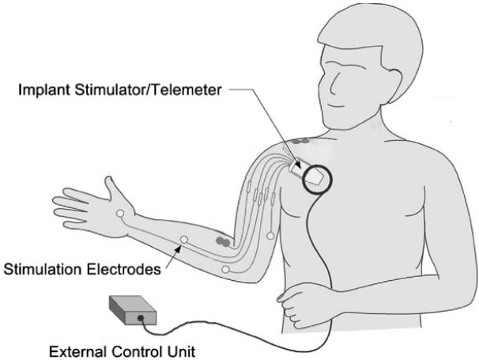

# A Motor Imagery based Brain Computer Interface to restore upper limb movements
This is a group project written during our acedemic years of a Master's Degree in ICT. 
  
**Abstraxt**
>Spinal Cord Injury (SCI) is a condition that
causes, for patients suffering from it, a huge lack of autonomy.
This is very expensive, both for families and society, as people
are often totally dependent on others also for the most basic
and everyday situations. In the recent years lot of investments
have been made for improving their lifestyle and autonomy.
Although several different approaches have been developed for
many BCI systems, we decided to implement our own setup
for SCI patients based on MI literature, and in particular on
MI training before the actual use of the BCI. Studies revealed
that in SCI there are several departures from healthy subjects
brain patterns, along with other preserved motor functions.
We analysed these brain activation patterns for upper limb
movements and we developed both a non-invasive and an
invasive BCI system. The former is based on FES, electrical
stimulation of arm and hand muscles, and the latter on an
implanted device called bridge, which aims to restore the
damages in the spinal cord bypassing them. Supported by the
literature, our results seem promising and we now expect to
implement the actual system and start the clinical trial.

Approach for the non-invasive BCI:
> 
>Typical representation of a functional electrical stimulation (FES) system [38].In our case the external control unit (ECU) is controlled by the classified and labelled signals as descrived in the corresponding section of the paper. 

Approach for the invasive BCI:
> 
>Representation of the intrusive system (figure adapted from [41]), on the right; the Proprioceptive feedback problem adressed for the invasive system, on the left (figure modified from [42]).  

 This work is licensed under a <a rel="license" href="http://creativecommons.org/licenses/by-nc-sa/4.0/">Creative Commons Attribution-NonCommercial-ShareAlike 4.0 International License</a>.
